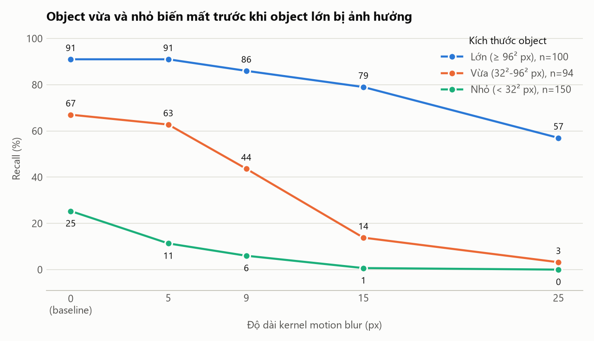
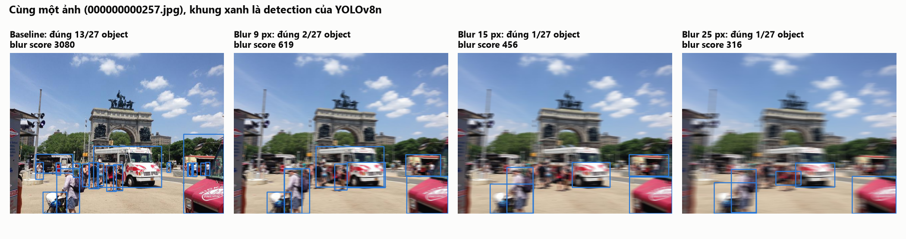

# Bước 3-4 · Thiết kế benchmark và kết quả

Chủ đề T1 — Camera degradation health score. Mọi số trong tài liệu này là kết quả tự đo, lấy từ [results/summary.csv](../results/summary.csv), [results/recall_by_size.csv](../results/recall_by_size.csv) và [results/run.log](../results/run.log).

## Bước 3 · Thiết kế

### Cấu hình cố định

| Mục | Giá trị |
|---|---|
| Dữ liệu | COCO128: 128 ảnh thật, là 128 ảnh đầu của COCO train2017, có nhãn chuẩn |
| Object được tính | 344 object thuộc 7 lớp: person, bicycle, car, motorcycle, bus, truck, traffic light |
| Model | YOLOv8n pretrained COCO, đóng băng, CPU, ảnh vào 640 px |
| Ngưỡng | Confidence ≥ 0.25; detection đúng khi cùng lớp và IoU ≥ 0.5 với một nhãn chưa được ghép |
| Ngẫu nhiên | Không có: kernel nhòe và hệ số gain xác định, nên không cần seed. Riêng latency dao động theo tải máy và chỉ đo một lượt |
| Cấu hình đầy đủ | [results/config.json](../results/config.json) |

### Điều kiện

Mỗi điều kiện lỗi được tạo từ chính ảnh baseline và chỉ đổi một tham số.

| Điều kiện | Tham số thay đổi | Điều metric cho phép kết luận |
|---|---|---|
| Baseline | Ảnh gốc, không gây lỗi | Mốc so sánh |
| Blur 5, 9, 15, 25 px | Độ dài kernel motion blur ngang, đều | Chênh lệch với baseline và xu hướng khi nhòe tăng |
| Gain ×1.5, ×2.5, ×4 | Nhân cường độ điểm ảnh rồi cắt ở 255 (quá sáng) | Health score có phân biệt được nhòe với quá sáng không |

### Định nghĩa metric (viết trước khi chạy)

| Metric | Cách tính | Đơn vị | Chiều tốt | Phản ánh |
|---|---|---|---|---|
| Recall | Tổng object được phát hiện đúng / 344 | % | Cao | Chất lượng thuật toán, metric thật |
| Precision | Detection đúng / tổng detection | % | Cao | Chất lượng thuật toán, metric thật |
| Confidence trung bình | Trung bình confidence của các detection đúng | 0-1 | Cao | Proxy; không phải mAP |
| Blur score | Phương sai của ảnh xám sau lọc Laplacian, lấy trung vị trên 128 ảnh | Không đơn vị | Cao = nét | Sức khỏe sensor |
| Saturation ratio | Tỉ lệ điểm ảnh xám ≥ 250 | % | Thấp | Sức khỏe sensor |
| Exposure | Độ sáng trung bình ảnh xám | 0-255 | Không có chiều | Sức khỏe sensor |
| Entropy | Entropy Shannon của histogram ảnh xám | bit | Cao | Sức khỏe sensor |
| Latency | Tiền xử lý + suy luận + hậu xử lý mỗi ảnh | ms | Thấp | Tài nguyên hệ thống |
| Cờ nhòe | % khung hình có blur score < 310.3 | % | — | Quy tắc health score |
| Cờ quá sáng | % khung hình có saturation ratio > 5.02% | % | — | Quy tắc health score |

Hai ngưỡng gắn cờ là phân vị 10% và 90% của baseline, nên tỉ lệ báo nhầm ở baseline bằng 10% theo cách đặt ngưỡng. Ngưỡng được đặt trên chính 128 ảnh dùng để đánh giá.

## Bước 4 · Kết quả

Lệnh đã chạy:

```powershell
.\.venv\Scripts\python.exe src\benchmark.py --kernels 5 9 15 25 --gains 1.5 2.5 4.0
.\.venv\Scripts\python.exe src\plots.py
```

### Bảng chính

| Điều kiện | Recall (%) | So với baseline (%) | Precision (%) | Confidence TB | Blur score | Saturation (%) | Entropy (bit) | Latency (ms) | Cờ nhòe (%) | Cờ quá sáng (%) |
|---|---|---|---|---|---|---|---|---|---|---|
| Baseline | 55.8 | 100.0 | 83.1 | 0.68 | 1285 | 1.6 | 7.39 | 98.6 | 10.2 | 10.2 |
| Blur 5 px | 48.5 | 87.0 | 79.9 | 0.68 | 333 | 1.3 | 7.33 | 90.5 | 47.7 | 9.4 |
| Blur 9 px | 39.5 | 70.8 | 72.0 | 0.67 | 212 | 1.2 | 7.31 | 89.6 | 68.8 | 9.4 |
| Blur 15 px | 27.0 | 48.4 | 62.4 | 0.65 | 138 | 1.1 | 7.29 | 81.5 | 77.3 | 7.0 |
| Blur 25 px | 17.4 | 31.3 | 57.7 | 0.54 | 87 | 1.0 | 7.27 | 71.3 | 89.1 | 5.5 |
| Gain ×1.5 | 54.4 | 97.4 | 80.3 | 0.67 | 2211 | 21.0 | 6.73 | 100.3 | 2.3 | 79.7 |
| Gain ×2.5 | 48.5 | 87.0 | 78.4 | 0.65 | 2889 | 45.1 | 5.14 | 91.3 | 1.6 | 98.4 |
| Gain ×4 | 31.1 | 55.7 | 69.0 | 0.64 | 2858 | 61.6 | 3.78 | 101.7 | 3.1 | 99.2 |

Exposure trung bình giữ nguyên 113.2 ở mọi mức nhòe; với gain lần lượt là 155.9, 194.7, 216.6.


### Recall theo kích thước object

| Điều kiện | Lớn (n=100) | Vừa (n=94) | Nhỏ (n=150) |
|---|---|---|---|
| Baseline | 91.0 | 67.0 | 25.3 |
| Blur 5 px | 91.0 | 62.8 | 11.3 |
| Blur 9 px | 86.0 | 43.6 | 6.0 |
| Blur 15 px | 79.0 | 13.8 | 0.7 |
| Blur 25 px | 57.0 | 3.2 | 0.0 |

Kích thước theo quy ước COCO: nhỏ dưới 32² px, vừa dưới 96² px, còn lại là lớn.



### Đối chiếu với claim ban đầu

| Dự đoán | Kết quả |
|---|---|
| Blur score giảm khi kernel tăng | Đúng: 1285 → 87 |
| Recall giảm | Đúng: 55.8% → 17.4% |
| Confidence trung bình giảm | Chỉ đúng một phần: gần như đứng yên tới 15 px (0.68 → 0.65), chỉ giảm rõ ở 25 px (0.54) |
| Exposure và entropy gần như không đổi khi chỉ có nhòe | Đúng: exposure không đổi, entropy giảm 0.12 bit |
| Latency không đổi | Không tăng; giảm từ 98.6 xuống 71.3 ms. Chỉ đo một lượt nên chưa kết luận được nguyên nhân |

### Trường hợp đáng phân tích

Ảnh `000000000257.jpg` có 27 object: baseline phát hiện đúng 13, blur 9 px còn 2, blur 15 px và 25 px còn 1. Blur score của ảnh này ở 25 px là 316, vẫn trên ngưỡng 310.3, nên không bị gắn cờ ở bất kỳ mức nhòe nào.



## Tự kiểm tra

- **Baseline:** hàng đầu của bảng chính, recall 55.8%, blur score 1285.
- **Điều kiện lỗi:** bảy hàng còn lại, mỗi hàng một tham số cụ thể.
- **Bằng chứng:** `results/run.log`, `results/config.json`, bốn tệp CSV và ba hình PNG.
