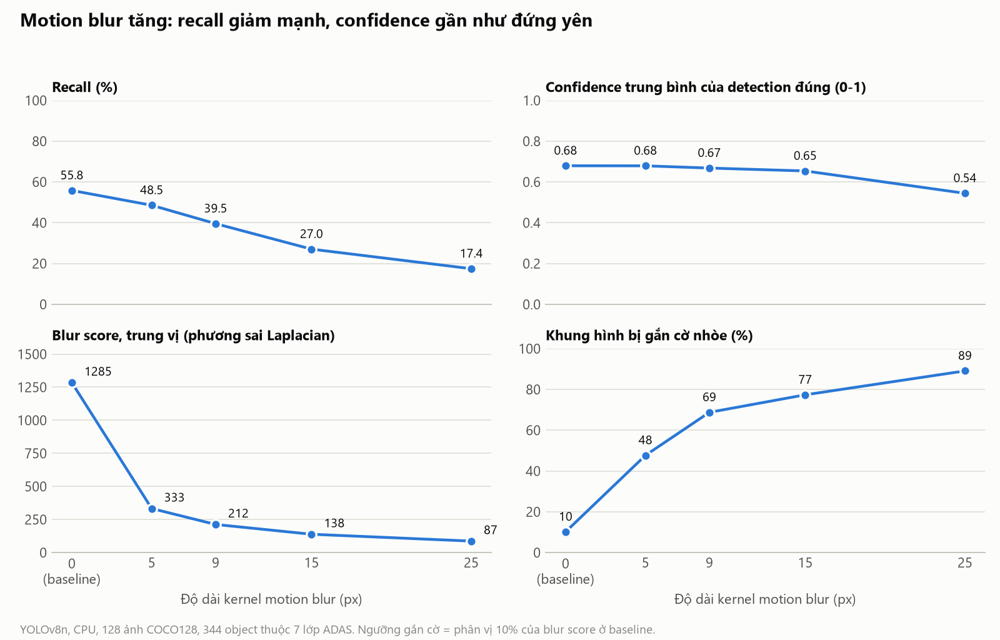

# Báo cáo cá nhân · Lab Ngày 4 — Sensor Reality Sprint

- **Họ tên: Nguyễn Cảnh Duy**
- **MSSV:** *2A202602815*
- **Chủ đề:** T1 — Camera degradation health score
- **Hình thức:** làm nhóm

## 1. Problem

- **Nền tảng và tính năng:** xe ADAS, phát hiện người và phương tiện phía trước cho cảnh báo va chạm (FCW) và phanh khẩn cấp (AEB).
- **Sensor:** camera RGB phía trước.
- **Failure thực tế:** motion blur khi phơi sáng dài trong điều kiện thiếu sáng, kết hợp xe rung hoặc chuyển động nhanh.
- **Claim ban đầu:** khi kernel nhòe tăng từ 0 lên 25 px, blur score giảm, recall giảm và confidence trung bình giảm.

## 2. Method

**Nguồn chính:** Aher, "Safety-Critical Camera Reliability Monitoring for ADAS via Degradation-Aware Uncertainty Pattern Analysis", arXiv:2605.05439, 05/2026 — https://arxiv.org/abs/2605.05439

|                        | Nội dung nguồn                                                                                                                                                   |
| ---------------------- | ------------------------------------------------------------------------------------------------------------------------------------------------------------------ |
| Input → output        | Một ảnh RGB → loại suy giảm, mức độ, điểm sức khỏe GSHI trong [0, 1] và bản đồ bất định                                                         |
| Metric                 | MAE điểm sức khỏe; tương quan GSHI với mAP50:95 của YOLOv8n; lead time trước khi mAP giảm 20% tương đối                                             |
| Dữ liệu              | KITTI với 12 loại suy giảm tổng hợp; DAWN cho thời tiết thật                                                                                               |
| Kết luận của nguồn | Motion blur có lead time ngắn nhất (0.10). Confidence của YOLO tương quan 0.90 với mAP nhưng không cảnh báo sớm                                        |
| Limitation nguồn nêu | Suy giảm tổng hợp; ngưỡng phải hiệu chuẩn lại theo xe và camera; chỉ xử lý khung hình đơn; chưa có rolling shutter; mới đánh giá trên KITTI |

**Nguồn nền:** Michaelis và cộng sự, arXiv:1907.07484 (https://arxiv.org/abs/1907.07484) cho cách làm "cùng ảnh, cùng model, chỉ đổi mức corruption"; repo https://github.com/bethgelab/imagecorruptions cho cách tạo motion blur.

**Phần tự làm:** không chạy được mạng của nguồn chính vì trang arXiv không có code. Thay vào đó, tái hiện phần baseline của nguồn: dùng chỉ số chất lượng ảnh và confidence của detector làm tín hiệu sức khỏe, rồi so với chất lượng detector thật khi nhòe tăng. Giả định: nhòe tổng hợp bằng kernel ngang đều.

## 3. Benchmark

| Mục         | Giá trị                                                                                                                        |
| ------------ | -------------------------------------------------------------------------------------------------------------------------------- |
| Dữ liệu    | COCO128, 128 ảnh thật có nhãn chuẩn; 344 object thuộc 7 lớp ADAS                                                          |
| Suy giảm    | Tổng hợp: motion blur ngang 5, 9, 15, 25 px; quá sáng gain ×1.5, ×2.5, ×4                                                 |
| Model        | YOLOv8n pretrained COCO, CPU, ảnh vào 640 px, confidence ≥ 0.25, IoU ≥ 0.5                                                   |
| Phiên bản  | Python 3.12.10, torch 2.14.1+cpu, ultralytics 8.4.173, opencv-python 5.0.0.93                                                    |
| Lệnh chạy  | `python src\benchmark.py --kernels 5 9 15 25 --gains 1.5 2.5 4.0` rồi `python src\plots.py`                                 |
| Bằng chứng | [results/run.log](../results/run.log), [results/summary.csv](../results/summary.csv), [results/config.json](../results/config.json) |

Kết quả tự đo:

| Điều kiện | Recall (%) | So với baseline (%) | Confidence TB (0-1) | Blur score | Khung hình bị gắn cờ nhòe (%) |
| ------------ | ---------- | -------------------- | ------------------- | ---------- | ---------------------------------- |
| Baseline     | 55.8       | 100.0                | 0.68                | 1285       | 10.2                               |
| Blur 5 px    | 48.5       | 87.0                 | 0.68                | 333        | 47.7                               |
| Blur 9 px    | 39.5       | 70.8                 | 0.67                | 212        | 68.8                               |
| Blur 15 px   | 27.0       | 48.4                 | 0.65                | 138        | 77.3                               |
| Blur 25 px   | 17.4       | 31.3                 | 0.54                | 87         | 89.1                               |
| Gain ×4     | 31.1       | 55.7                 | 0.64                | 2858       | 3.1                                |

Blur score là phương sai Laplacian, lấy trung vị trên 128 ảnh. Cờ nhòe bật khi blur score dưới 310.3, là phân vị 10% của baseline.

Claim đúng với blur score và recall. Claim sai một phần với confidence: nó gần như đứng yên tới 15 px.

## 4. Failure case

**Ở blur 15 px, camera mất một nửa khả năng phát hiện nhưng tín hiệu sức khỏe không báo động đủ.**

- **Đo được:** recall giảm từ 55.8% xuống 27.0%. Object cỡ vừa giảm từ 67.0% xuống 13.8%, cỡ nhỏ từ 25.3% xuống 0.7%, cỡ lớn từ 91.0% xuống 79.0% ([fig2](../results/fig2_recall_by_size.png)).
- **Đo được:** confidence trung bình chỉ đổi từ 0.68 xuống 0.65.
- **Đo được:** 29 trên 128 khung hình không bị gắn cờ nhòe, và chúng chứa 144 trên 344 object. Blur score ở baseline trải từ 17 tới 29509 tùy cảnh.
- **Ví dụ:** ảnh `000000000257.jpg` giảm từ 13 xuống 1 object đúng trên 27, nhưng blur score không lần nào xuống dưới ngưỡng ([fig3](../results/fig3_before_after.png)).
- **Nguồn cho biết:** Aher (2026) cũng kết luận confidence của YOLO không cảnh báo sớm, đo trên KITTI với mAP50:95. Cùng hướng, không cùng con số.
- **Giả thuyết:** confidence chỉ tính trên object còn sống sót nên không phản ánh object đã mất; phương sai Laplacian đo lượng cạnh nên phụ thuộc nội dung cảnh.

Giới hạn của phép thử: COCO128 nằm trong tập train của YOLOv8n nên chỉ đọc mức giảm tương đối; nhòe là tổng hợp; ngưỡng được đặt và đánh giá trên cùng 128 ảnh; chưa đo trên video hay dữ liệu lái xe.

## 5. Engineering decision

**Quyết định:** không dùng confidence của detector để đánh giá sức khỏe camera. Dùng health score tính trực tiếp trên ảnh, gồm blur score chuẩn hóa theo cảnh và cờ quá sáng, để hạ trọng số camera trong fusion.

- **Vì sao cần cả hai cờ:** ở gain ×4, blur score tăng lên 2858 và chỉ 3.1% khung hình bị gắn cờ nhòe, trong khi recall còn 55.7% so với baseline. Cờ quá sáng bắt được 99.2%.
- **Cải tiến:** chia blur score cho trung vị của chính camera đó trong vài giây gần nhất, thay cho ngưỡng tuyệt đối.
- **Fallback khi bị gắn cờ:** hạ trọng số camera, không coi "camera không thấy gì" là "đường trống", dựa vào radar cho khoảng cách phía trước.
- **Kiểm chứng vòng sau:** chạy lại trên chuỗi video với tỉ lệ báo nhầm 10%, so tỉ lệ gắn cờ ở 5, 9, 15 px với 47.7%, 68.8%, 77.3% hiện tại.

Trade-off:

- **Nên dùng** health score rẻ này khi cần tín hiệu chạy mọi khung hình trên phần cứng nhúng: nó chỉ là một phép lọc Laplacian và một histogram.
- **Không nên dùng một mình** cho quyết định an toàn: ngưỡng chặt hơn bắt được nhiều khung hình nhòe hơn nhưng tăng báo nhầm, làm giảm thời gian camera khả dụng. Cờ quá sáng hiện tại đã bật trên 79.7% khung hình ở gain ×1.5, khi recall mới giảm còn 97.4%.
- **Ngưỡng phụ thuộc bối cảnh:** hệ thống chạy đường cao tốc cần ngưỡng chặt hơn hệ thống hỗ trợ đỗ xe tốc độ thấp, như nguồn chính cũng nêu.

Chi tiết từng bước: [docs/](../docs/).
